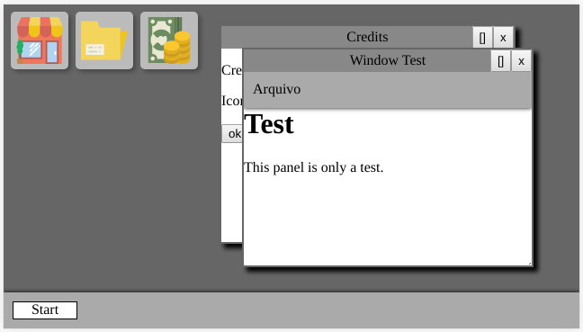

# FOS - Fake Operating System

Web Components to turn your web app into a fake operating system.



Live example [here](https://victorribeiro.com/fos)

## About

This is my first experiment writting webcomponents. I kind ran with the idea and made this project that can be used to create awesome / fun / creative web apps. Hope you like it.

## How to use

[Watch the creation of a basic web app using FOS here](https://www.youtube.com/watch?v=rddE1jKPgWk)


Add the JavaScript file to your project

```html
<script src="fos.min.js"></script>
```

Then just start typing HTML like it is the 90's.

## Components

All the component can be stylized with CSS just like a regular [DOM](https://www.w3schools.com/jsref/dom_obj_all.asp) element.

### fos-desktop

This is a wrapper for all the icons, bars, windows...

**custom attributes**  
*iconOffset* - int - will off set the start position of the icons.

### fos-icon

This is a icon. It's draggable by default. It moves on a grid of 8 x 8 pixels.

### fos-window

This is a window application. You can write html directly inside of it. Or you can make something more complex and add a fos-bar -> fos-menu -> fos-menu-item and a fos-panel inside of it. Each fos-menu-item controls a fos-panel.

**custom attributes**  
*title* - String - Sets the title displayed on top of the window.

### fos-bar

This is just a wrapper for the menu. Can be placed on top or bottom of fos-desktop / fos-window.

**custom attributes**  
*position* - top | bottom - Sets the position of the bar. Values can be top or bottom.

### fos-menu

This is a menu that is only visible when clicked. It houses fos-menu-item.

### fos-menu-item

This is items of a menu. It should control a panel.

### fos-panel

This is a wrapper for your content. The idea is that you write your HTML inside of it and call it by clicking on a fos-menu-item.


New components can be added later on.

## Example

Let's create fake operating system.  

We should start with a desktop.

```html
<fos-desktop>
</fos-desktop>
```

Nice!

Now we should create some icons. You don't need to stress about where each icon will be on the fos-desktop. They will be spread out across the screen automatically, from top-left to bottom-right.

```html
<fos-desktop>

	<fos-icon>F</fos-icon>
	<fos-icon>O</fos-icon>
	<fos-icon>S</fos-icon>

</fos-desktop>
```

Cool!

Now the icons can be used to open windows. So we should crate some windows and then linking them to an icon. This can be done by setting a **name** attribute on a window and a **href** attribute on the icon.

```html
<fos-desktop>

	<fos-icon href="w1">F</fos-icon>
	<fos-icon href="w2">O</fos-icon>
	<fos-icon href="w3">S</fos-icon>

	<fos-window name="w1" title="Window 1"></fos-window>
	<fos-window name="w1" title="Window 1"></fos-window>
	<fos-window name="w1" title="Window 1"></fos-window>

</fos-desktop>
```

This is going really well. Now when we double click the icon (yes, yes I know - but I like double clicks) it will open a window.

The window can be dragged around by its top part. It also can be resized by it's bottom right corner. It can be maximized clicking on the **[]** button or closed clicking on the **X** button, both on the right top corner.

Our fake os is kinda lame right now, but when can mess around with the sytle using CSS. You can add a nice background image to the desktop and create some nice images for the icons, instead of letters.

Well, you can do that whenever you want. But for this tutorial, we should add a bar on the bottom of the screen and a Start menu. The Start menu will also control the windows.

```html
<fos-desktop>

	<fos-icon href="w1">F</fos-icon>
	<fos-icon href="w2">O</fos-icon>
	<fos-icon href="w3">S</fos-icon>

	<fos-window name="w1" title="Window 1">
		<h2>Test 1</h2>
	</fos-window>
	
	<fos-window name="w2" title="Window 2">
		<h1>Hello</h1>
		<p>How are you on this fine morning/afternoon/night?</p>
		<p><a href="javascript:alert('hi');">Click here to say hi</a></p>
	</fos-window>
	
	<fos-window name="w3" title="Window 3">
		???
	</fos-window>

	<fos-bar>
		<fos-menu name="Start">
			<fos-menu-item href="w1">
				Window 1
			</fos-menu-item>
			<fos-menu-item href="w2">
				Window 2
			</fos-menu-item>
			<fos-menu-item href="w3">
				Window 3
			</fos-menu-item>
		</fos-menu>
	</fos-bar>

</fos-desktop>
```

fos-widow can have html written direct into them, but if you want to separate your content you could use the same schema fos-bar -> fos-menu -> fos-menu-item controling a fos-pane. Let's see how simple it is to do just that:

```html
<fos-desktop>

	<fos-icon href="w1">F</fos-icon>
	<fos-icon href="w2">O</fos-icon>
	<fos-icon href="w3">S</fos-icon>

	<fos-window name="w1" title="Window 1">
		<h2>Test 1</h2>
	</fos-window>
	
	<fos-window name="w2" title="Window 2">
		<h1>Hello</h1>
		<p>How are you on this fine morning/afternoon/night?</p>
		<p><a href="javascript:alert('hi');">Click here to say hi</a></p>
	</fos-window>
	
	<fos-window name="w3" title="Window 2">
		<fos-bar position="top">
			<fos-menu name="File">
				<fos-menu-item href="file1">File 1</fos-menu-item>
				<fos-menu-item href="file2">File 2</fos-menu-item>
			</fos-menu>
		</fos-bar>
		<br>
		<fos-panel name="file1" selected>
			<h1>Panel 1</h1>
			<p>Hi, this is the panel one.</p>
		</fos-panel>
		<fos-panel name="file2">
			<h1>Panel 2</h1>
			<p>Hello again, this is the panel two.</p>
		</fos-panel>
	</fos-window>

	<fos-bar>
		<fos-menu name="Start">
			<fos-menu-item href="w1">
				Window 1
			</fos-menu-item>
			<fos-menu-item href="w2">
				Window 2
			</fos-menu-item>
			<fos-menu-item href="w3">
				Window 3
			</fos-menu-item>
		</fos-menu>
	</fos-bar>

</fos-desktop>
```

fos-bar can be placed on the top or the bottom of your fos-desktop / fos-window and the fos-menu inside it will behave accordingly: if it's on the bottom, the menu will open up; if it's on the top, the menu will drop down. Cool, right?! To place the fos-bar on top, just pass to the attribute **position** one of the values **top** or **bottom**.

"Wait! If the fos-bar can be placed on the top, it will be displayed over me icons."

You right. To address it, the fos-desktop have a special iconOffset to address this. The value passed to that attribute will move the icons. E.g.: 20px, 40px, 55px...

Well, that's it. Hope you had fun creating a Fake OS web app.

## Projects that uses FOS

[Virtual Cybersecurity Escape Room(https://eloeffler.gitlab.io/eloeffler/proto-vcser/)

